Hierarchical Clustering
========================================================

## 04W03L01-03

Easy example

1. Creating a data and plotting them.

    
    ```r
    set.seed(1234)
    par(mar = c(0, 0, 0, 0))
    x <- rnorm(12, mean = rep(1:3, each = 4), sd = 0.2)
    y <- rnorm(12, mean = rep(c(1, 2, 1), each = 4), sd = 0.2)
    plot(x, y, col = "blue", pch = 19, cex = 2)
    text(x + 0.05, y + 0.05, labels = as.character(1:12))
    ```
    
    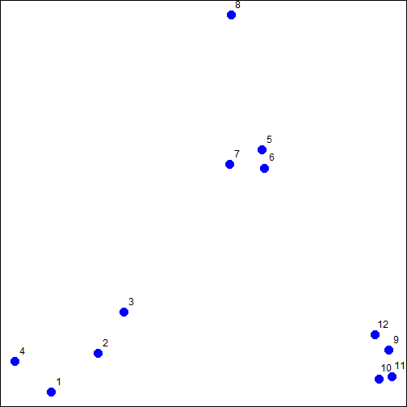 
2. Creating a **data frame** and **DISTANCE**  
    dist(x, method = "euclidean", diag = FALSE, upper = FALSE, p = 2)  
    the distance measure to be used. This must be one of "euclidean", "maximum", "manhattan", "canberra",
    "binary" or "minkowski". Any unambiguous substring can be given.
    
    
    ```r
    dataFrame <- data.frame(x = x, y = y)
    distxy<-dist(dataFrame)
    distxy
    ```
    
    ```
    ##          1       2       3       4       5       6       7       8       9
    ## 2  0.34121                                                                
    ## 3  0.57494 0.24103                                                        
    ## 4  0.26382 0.52579 0.71862                                                
    ## 5  1.69425 1.35818 1.11953 1.80667                                        
    ## 6  1.65813 1.31960 1.08339 1.78081 0.08150                                
    ## 7  1.49823 1.16621 0.92569 1.60132 0.21110 0.21667                        
    ## 8  1.99149 1.69093 1.45649 2.02849 0.61704 0.69792 0.65063                
    ## 9  2.13630 1.83168 1.67836 2.35676 1.18350 1.11500 1.28583 1.76461        
    ## 10 2.06420 1.76999 1.63110 2.29239 1.23848 1.16550 1.32063 1.83518 0.14090
    ## 11 2.14702 1.85183 1.71074 2.37462 1.28154 1.21077 1.37370 1.86999 0.11624
    ## 12 2.05664 1.74663 1.58659 2.27232 1.07701 1.00777 1.17740 1.66224 0.10849
    ##         10      11
    ## 2                 
    ## 3                 
    ## 4                 
    ## 5                 
    ## 6                 
    ## 7                 
    ## 8                 
    ## 9                 
    ## 10                
    ## 11 0.08318        
    ## 12 0.19129 0.20803
    ```
3. Plotting dendrogram
    
    
    ```r
    hClustering <- hclust(distxy)
    plot(hClustering)
    ```
    
    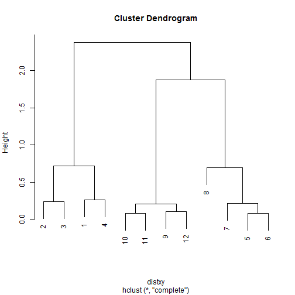 
    
4. Prettier one  
    function:
        
    
    ```r
    myplclust <- function(hclust, lab = hclust$labels, lab.col = rep(1, length(hclust$labels)),
    hang = 0.1, ...) {
    ## modifiction of plclust for plotting hclust objects *in colour*! Copyright
    ## Eva KF Chan 2009 Arguments: hclust: hclust object lab: a character vector
    ## of labels of the leaves of the tree lab.col: colour for the labels;
    ## NA=default device foreground colour hang: as in hclust & plclust Side
    ## effect: A display of hierarchical cluster with coloured leaf labels.
    y <- rep(hclust$height, 2)
    x <- as.numeric(hclust$merge)
    y <- y[which(x < 0)]
    x <- x[which(x < 0)]
    x <- abs(x)
    y <- y[order(x)]
    x <- x[order(x)]
    plot(hclust, labels = FALSE, hang = hang, ...)
    text(x = x, y = y[hclust$order] - (max(hclust$height) * hang), labels = lab[hclust$order],
    col = lab.col[hclust$order], srt = 90, adj = c(1, 0.5), xpd = NA, ...)
    }
    ```
    and its use
        
    
    ```r
    myplclust(hClustering, lab = rep(1:3, each = 4), lab.col = rep(1:3, each = 4))
    ```
    
    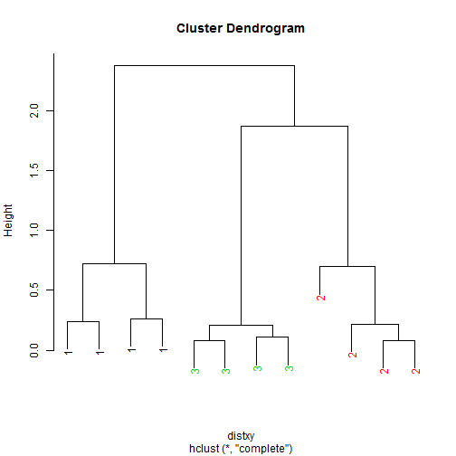 
    
5. heatmap
    
    ```r
    set.seed(143)
    dataMatrix <- as.matrix(dataFrame)[sample(1:12), ]
    heatmap(dataMatrix)
    ```
    
    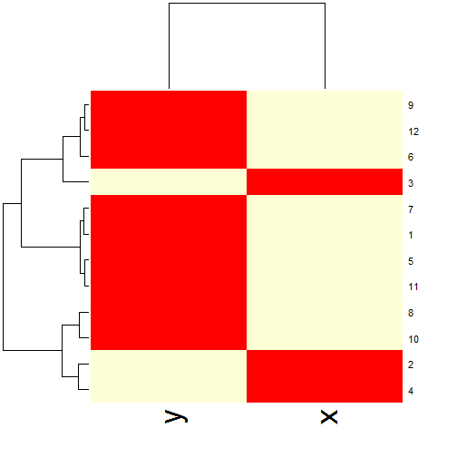 
## Better dendrograms

[From](http://rstudio-pubs-static.s3.amazonaws.com/1876_df0bf890dd54461f98719b461d987c3d.html) 


```r
# prepare hierarchical cluster
hc = hclust(dist(mtcars))
# very simple dendrogram
plot(hc)
```

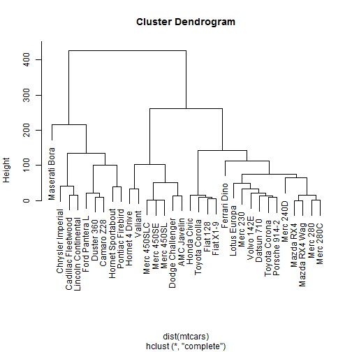 

```r
# labels at the same level
plot(hc, hang = -1)
```

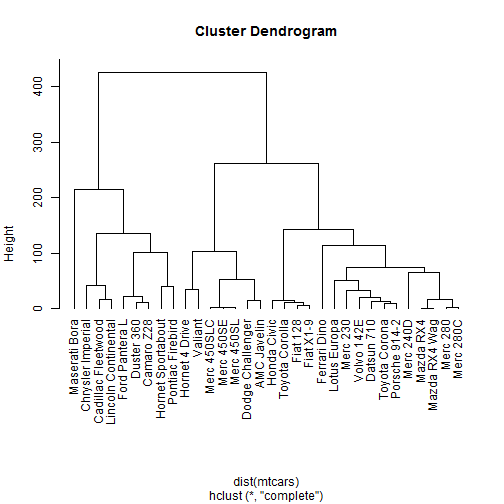 
    
    

```r
# tweeking some parameters
op = par(bg = "#DDE3CA")
plot(hc, col = "#487AA1", col.main = "#45ADA8", col.lab = "#7C8071", 
    col.axis = "#F38630", lwd = 3, lty = 3, sub = "", hang = -1, axes = FALSE)
# add axis
axis(side = 2, at = seq(0, 400, 100), col = "#F38630", labels = FALSE, 
    lwd = 2)
# add text in margin
mtext(seq(0, 400, 100), side = 2, at = seq(0, 400, 100), line = 1, 
    col = "#A38630", las = 2)
```

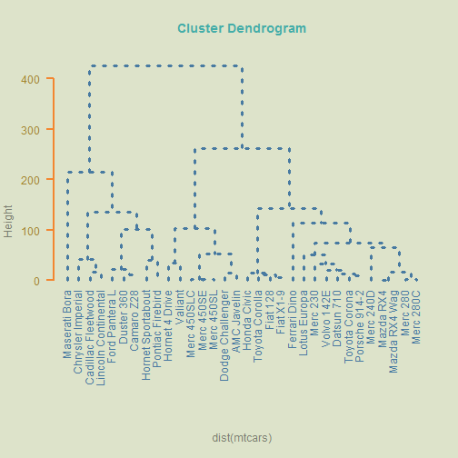 

    

```r
par(op)
```

Alternatives

```r
# using dendrogram objects
hcd = as.dendrogram(hc)
# alternative way to get a dendrogram
plot(hcd)
```

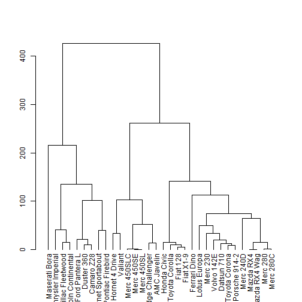 

    

```r
# using dendrogram objects
plot(hcd, type = "triangle")
```

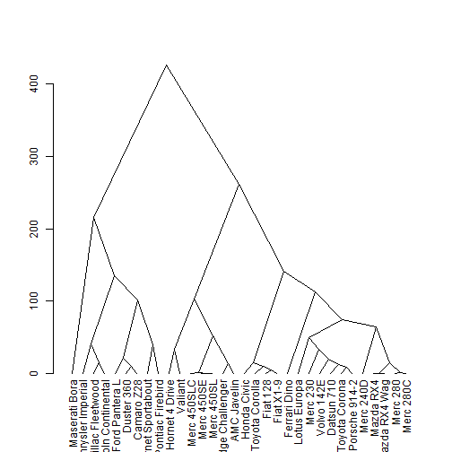 

**ZOOMING**


```r
# plot dendrogram with some cuts
op = par(mfrow = c(2, 1))
plot(cut(hcd, h = 75)$upper, main = "Upper tree of cut at h=75")
plot(cut(hcd, h = 75)$lower[[2]], main = "Second branch of lower tree with cut at h=75")
```

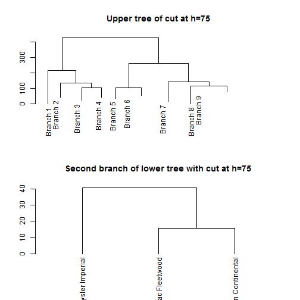 

**CUSTOMIZE** - function dendrapply


```r
# vector of colors labelColors = c('red', 'blue', 'darkgreen', 'darkgrey',
# 'purple')
labelColors = c("#CDB380", "#036564", "#EB6841", "#EDC951")
# cut dendrogram in 4 clusters
clusMember = cutree(hc, 4)
# function to get color labels
colLab <- function(n) {
    if (is.leaf(n)) {
        a <- attributes(n)
        labCol <- labelColors[clusMember[which(names(clusMember) == a$label)]]
        attr(n, "nodePar") <- c(a$nodePar, lab.col = labCol)
    }
    n
}
# using dendrapply
clusDendro = dendrapply(hcd, colLab)
# make plot
plot(clusDendro, main = "Cool Dendrogram", type = "triangle")
```

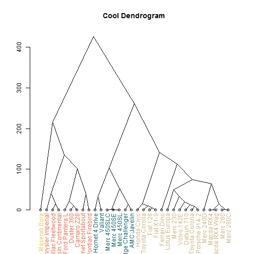 

Phylogenetic


```r
# load package ape; remember to install it: install.packages('ape')
library(ape)
```

```
## Warning: package 'ape' was built under R version 3.1.1
```

```r
# plot basic tree
plot(as.phylo(hc), cex = 0.9, label.offset = 1)
```

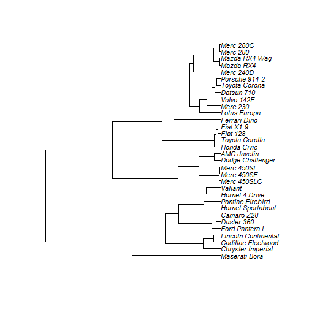 

another graphs


```r
# cladogram
plot(as.phylo(hc), type = "cladogram", cex = 0.9, label.offset = 1)
```

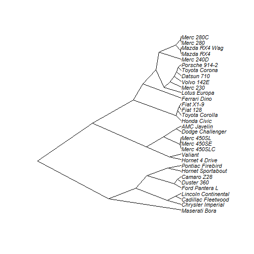 

```r
# unrooted
plot(as.phylo(hc), type = "unrooted")
```

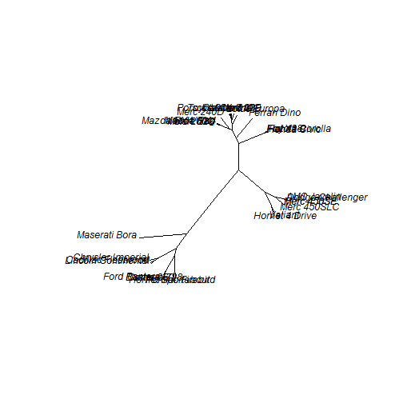 

```r
# fan
plot(as.phylo(hc), type = "fan")
```

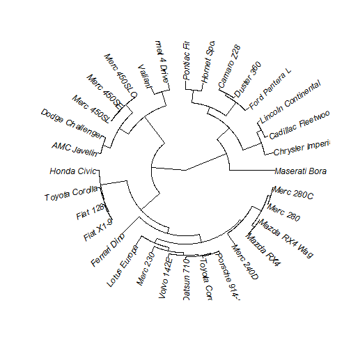 

```r
# radial
plot(as.phylo(hc), type = "radial")
```

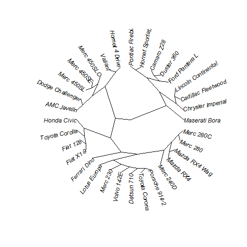 

```r
# add colors randomly
plot(as.phylo(hc), type = "fan", tip.color = hsv(runif(15, 0.65, 
    0.95), 1, 1, 0.7), edge.color = hsv(runif(10, 0.65, 0.75), 1, 1, 0.7), edge.width = runif(20, 
    0.5, 3), use.edge.length = TRUE, col = "gray80")
```

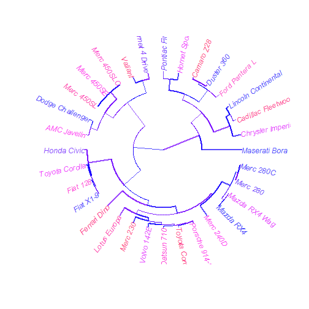 

```r
# vector of colors
mypal = c("#556270", "#4ECDC4", "#1B676B", "#FF6B6B", "#C44D58")
# cutting dendrogram in 5 clusters
clus5 = cutree(hc, 5)
# plot
op = par(bg = "#E8DDCB")
# Size reflects miles per gallon
plot(as.phylo(hc), type = "fan", tip.color = mypal[clus5], label.offset = 1, 
    cex = log(mtcars$mpg, 10), col = "red")
```

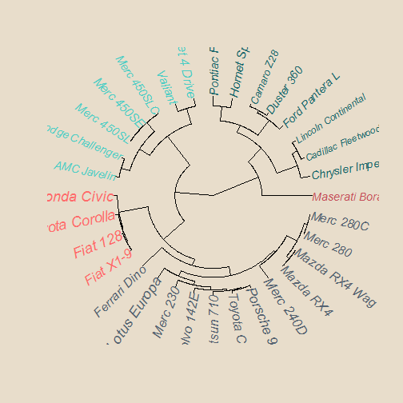 

color in leaves


```r
# install.packages('sparcl')
library(sparcl)
```

```
## Error: there is no package called 'sparcl'
```

```r
# colors the leaves of a dendrogram
y = cutree(hc, 3)
ColorDendrogram(hc, y = y, labels = names(y), main = "My Simulated Data", 
    branchlength = 80)
```

```
## Error: could not find function "ColorDendrogram"
```

ggdendro


```r
# install.packages('ggdendro')
library(ggdendro)
```

```
## Warning: package 'ggdendro' was built under R version 3.1.1
```

```r
# basic option
ggdendrogram(hc)
```

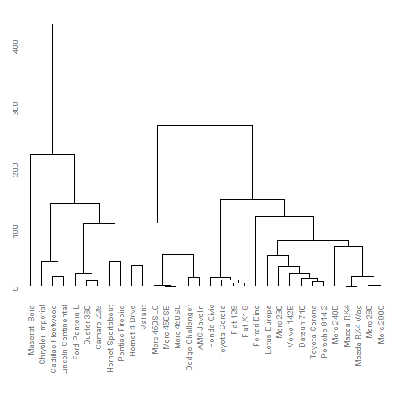 

```r
# another option
ggdendrogram(hc, rotate = TRUE, size = 4, theme_dendro = FALSE, color = "tomato")
```

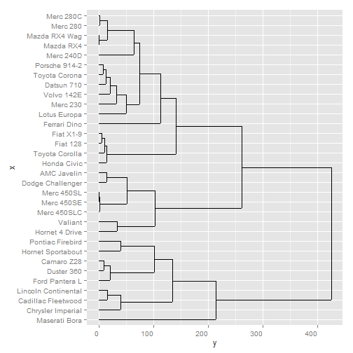 

```r
# Triangular lines
ddata <- dendro_data(as.dendrogram(hc), type = "triangle")
ggplot(segment(ddata)) + geom_segment(aes(x = x, y = y, xend = xend, 
    yend = yend)) + ylim(-10, 150) + geom_text(data = label(ddata), aes(x = x, 
    y = y, label = label), angle = 90, lineheight = 0)
```

```
## Error: could not find function "ggplot"
```

colored


```r
# load code of A2R function
source("http://addictedtor.free.fr/packages/A2R/lastVersion/R/code.R")
# colored dendrogram
op = par(bg = "#EFEFEF")
A2Rplot(hc, k = 3, boxes = FALSE, col.up = "gray50", col.down = c("#FF6B6B", 
    "#4ECDC4", "#556270"))
```

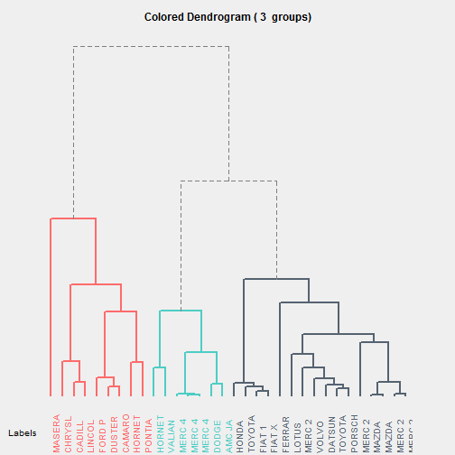 

```r
par(op)
# another colored dendrogram
op = par(bg = "gray15")
cols = hsv(c(0.2, 0.57, 0.95), 1, 1, 0.8)
A2Rplot(hc, k = 3, boxes = FALSE, col.up = "gray50", col.down = cols)
```

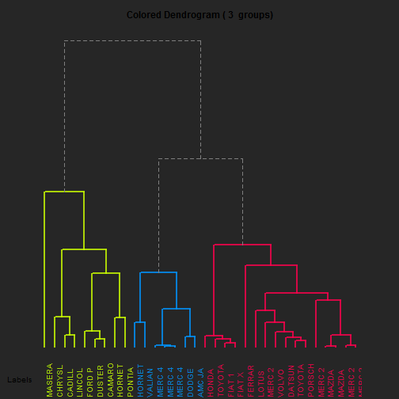 


