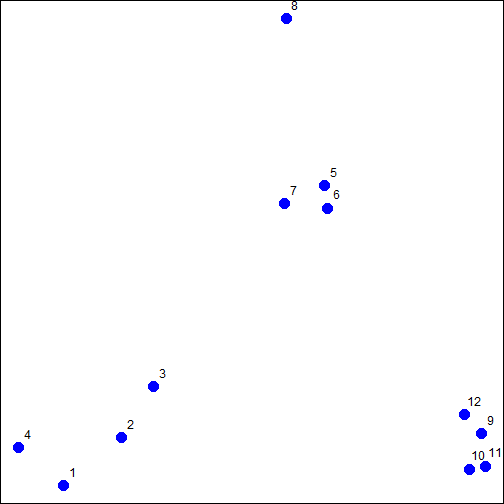

k means
========================================================

## 04W03L04-05

1. data
    
    
    ```r
    set.seed(1234)
    par(mar = c(0, 0, 0, 0))
    x <- rnorm(12, mean = rep(1:3, each = 4), sd = 0.2)
    y <- rnorm(12, mean = rep(c(1, 2, 1), each = 4), sd = 0.2)
    plot(x, y, col = "blue", pch = 19, cex = 2)
    text(x + 0.05, y + 0.05, labels = as.character(1:12))
    ```
    
     
2. k-means

    
    ```r
    dataFrame <- data.frame(x, y)
    kmeansObj <- kmeans(dataFrame, centers = 3)
    names(kmeansObj)
    ```
    
    ```
    ## [1] "cluster"      "centers"      "totss"        "withinss"    
    ## [5] "tot.withinss" "betweenss"    "size"         "iter"        
    ## [9] "ifault"
    ```
    
    ```r
    kmeansObj$cluster
    ```
    
    ```
    ##  [1] 3 3 3 3 1 1 1 1 2 2 2 2
    ```
    
    ```r
    kmeansObj$centers
    ```
    
    ```
    ##        x      y
    ## 1 1.9907 2.0078
    ## 2 2.8535 0.9831
    ## 3 0.8905 1.0069
    ```
    
3. vykreslení
    
    
    ```r
    par(mar = rep(0.2, 4))
    plot(x, y, col = kmeansObj$cluster, pch = 19, cex = 2)
    points(kmeansObj$centers, col = 1:3, pch = 3, cex = 3, lwd = 3)
    ```
    
     
4. heatmaps
    
    
    ```r
    set.seed(1234)
    dataMatrix <- as.matrix(dataFrame)[sample(1:12), ]
    kmeansObj2 <- kmeans(dataMatrix, centers = 3)
    par(mfrow = c(1, 2), mar = c(2, 4, 0.1, 0.1))
    image(t(dataMatrix)[, nrow(dataMatrix):1], yaxt = "n")
    image(t(dataMatrix)[, order(kmeansObj$cluster)], yaxt = "n")
    ```
    
     

