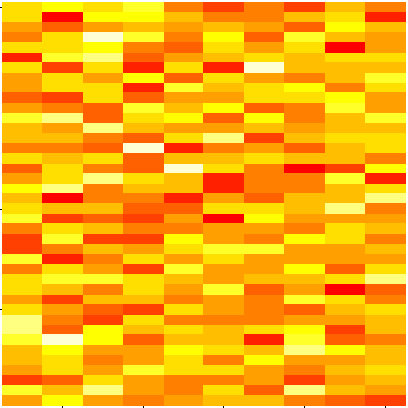

PCA and SVD
========================================================

## 04W03L06-07


```r
set.seed(12345)
par(mar = rep(0.2, 4))
dataMatrix <- matrix(rnorm(400), nrow = 40)
image(1:10, 1:40, t(dataMatrix)[, nrow(dataMatrix):1])
```

 

```r
par(mar = rep(0.2, 4))
heatmap(dataMatrix)
```

 

adding a pattern


```r
set.seed(678910)
for (i in 1:40) {
# flip a coin
coinFlip <- rbinom(1, size = 1, prob = 0.5)
# if coin is heads add a common pattern to that row
if (coinFlip) {
dataMatrix[i, ] <- dataMatrix[i, ] + rep(c(0, 3), each = 5)
}
}

par(mar = rep(0.2, 4))
image(1:10, 1:40, t(dataMatrix)[, nrow(dataMatrix):1])
```

 

```r
par(mar = rep(0.2, 4))
heatmap(dataMatrix)
```

 

##Hraní si se SVD a PCA

1. data
    
    ```r
    set.seed(25)
    X<- cbind(rnorm(10,mean=(rep(c(-1,1),each=5)),sd=0.5),rnorm(10,mean=(rep(c(1,-1),each=5)),sd=0.5))
    X
    ```
    
    ```
    ##          [,1]    [,2]
    ##  [1,] -1.1059  0.1286
    ##  [2,] -1.5208  0.3375
    ##  [3,] -1.5767  0.7260
    ##  [4,] -0.8392  0.2718
    ##  [5,] -1.7501  1.0413
    ##  [6,]  0.7772 -0.5362
    ##  [7,]  1.8670 -1.3584
    ##  [8,]  1.2556 -0.5188
    ##  [9,]  1.0498 -0.2271
    ## [10,]  0.9711 -1.5049
    ```
    
    ```r
    plot(X[,1],X[,2],col="red",pch=18,cex=2)
    text(X[,1]+0.05,X[,2]+0.05,labels=as.character(1:12))
    ```
    
     

2. SVD

    
    ```r
    SVD1<-svd(scale(X))
    SVD1$u
    ```
    
    ```
    ##          [,1]      [,2]
    ##  [1,] -0.1857 -0.270955
    ##  [2,] -0.2797 -0.304888
    ##  [3,] -0.3664 -0.002632
    ##  [4,] -0.1822 -0.012889
    ##  [5,] -0.4526  0.177290
    ##  [6,]  0.1830  0.124408
    ##  [7,]  0.4862 -0.019225
    ##  [8,]  0.2384  0.383470
    ##  [9,]  0.1531  0.526778
    ## [10,]  0.4059 -0.601358
    ```
    
    ```r
    SVD1$d
    ```
    
    ```
    ## [1] 4.1242 0.9954
    ```
    
    ```r
    SVD1$v
    ```
    
    ```
    ##         [,1]   [,2]
    ## [1,]  0.7071 0.7071
    ## [2,] -0.7071 0.7071
    ```
    
    ```r
    par(mfrow=c(2,2))
    image(t(X))
    plot(X[,1],X[,2],col="red",pch=18,cex=2)
    text(X[,1]+0.05,X[,2]+0.05,labels=as.character(1:12))
    plot(SVD1$u[,1],1:nrow(X),xlab="Row",ylab="First left singular vector")
    plot(SVD1$v[,1],1:ncol(X),xlab="Col",ylab="First right singular vector")
    ```
    
     
    
    nové souøadnice a rozptyly
        
    
    ```r
    Y<-X%*%SVD1$v
    par(mfrow=c(2,2))
    plot(Y[,1],Y[,2],col="red",pch=18,cex=2,main="Nové souøadnice")
    plot(SVD1$d,xlab="column",ylab="singular value",pch=20)
    plot(SVD1$d/sum(SVD1$d),xlab="column",ylab="% vysvìtlení",pch=21)
    plot(SVD1$d^2/sum(SVD1$d^2),xlab="column",ylab="%vysvìtlení na druhou",pch=21)
    ```
    
     
3. PCA
    
    
    ```r
    pca1<-prcomp(X,scale=TRUE)
    pca1$sdev
    ```
    
    ```
    ## [1] 1.3747 0.3318
    ```
    
    ```r
    pca1$sdev^2
    ```
    
    ```
    ## [1] 1.8899 0.1101
    ```
    
    ```r
    pca1$rotation
    ```
    
    ```
    ##          PC1    PC2
    ## [1,]  0.7071 0.7071
    ## [2,] -0.7071 0.7071
    ```
    
    ```r
    pca1$x
    ```
    
    ```
    ##           PC1      PC2
    ##  [1,] -0.7657 -0.26972
    ##  [2,] -1.1536 -0.30350
    ##  [3,] -1.5113 -0.00262
    ##  [4,] -0.7515 -0.01283
    ##  [5,] -1.8666  0.17648
    ##  [6,]  0.7547  0.12384
    ##  [7,]  2.0054 -0.01914
    ##  [8,]  0.9831  0.38172
    ##  [9,]  0.6313  0.52438
    ## [10,]  1.6742 -0.59862
    ```
    
    ```r
    pca1$scale
    ```
    
    ```
    ## [1] 1.3914 0.8343
    ```
    
    ```r
    par(mfrow=c(2,2))
    plot(pca1$x,main="nové souøadnice")
    vlvekt<-pca1$sdev
    #vlvekt<-pca1$sdev^2
    plot(pca1$sdev,xlab="column",ylab="singular value",pch=20)
    plot(pca1$sdev/sum(pca1$sdev),xlab="column",ylab="% vysvìtlení",pch=21)
    plot(pca1$sdev^2/sum(pca1$sdev^2),xlab="column",ylab="%vysvìtlení na druhou",pch=21)
    ```
    
     

4. problém je porovnat vl èísla:

    
    ```r
    SVD1$d
    ```
    
    ```
    ## [1] 4.1242 0.9954
    ```
    
    ```r
    pca1$sdev
    ```
    
    ```
    ## [1] 1.3747 0.3318
    ```
    
    ```r
    print("pomìry")
    ```
    
    ```
    ## [1] "pomìry"
    ```
    
    ```r
    SVD1$d[1]/SVD1$d[2]
    ```
    
    ```
    ## [1] 4.143
    ```
    
    ```r
    SVD1$d[1]^2/SVD1$d[2]^2
    ```
    
    ```
    ## [1] 17.17
    ```
    
    ```r
    pca1$sdev[1]/pca1$sdev[2]
    ```
    
    ```
    ## [1] 4.143
    ```
    
    ```r
    pca1$sdev[1]^2/pca1$sdev[2]^2
    ```
    
    ```
    ## [1] 17.17
    ```
